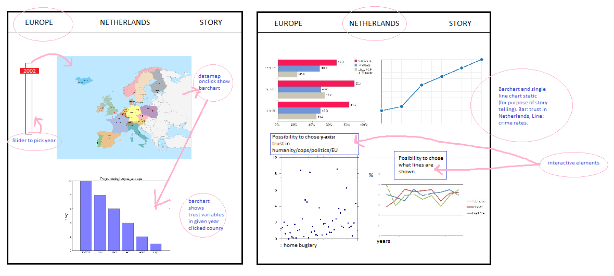

# Design Document

## Data Sources:

- [CBS, Europa Vertrouwen 2002-2014](http://statline.cbs.nl/StatWeb/publication/?VW=T&DM=SLNL&PA=80518ned&D1=0-7&D2=0&D3=a&D4=a&HD=100816-1530&HDR=T&STB=G1,G2,G3) CSV

- [CBS, Nederland Vertrouwen 2006 - 2012](https://opendata.cbs.nl/statline/#/CBS/nl/dataset/71719NED/table?dl=8CA2) CSV/JSON

- [CBS, Nederland Vertrouwen 2012-2017](http://statline.cbs.nl/Statweb/publication/?VW=T&DM=SLNL&PA=82378ned) CSV

- [CBS, Nederland Woninginbraak 2010-2017](http://statline.cbs.nl/Statweb/publication/?DM=SLNL&PA=83651NED&D1=0&D2=0&D3=14&D4=0&D5=a&HDR=G4%2cG3%2cG1%2cT&STB=G2&VW=D) CSV

- [CBS, Geregistreerde Misdaad 1999-2016 (totalen)](https://opendata.cbs.nl/statline/#/CBS/nl/dataset/83723NED/table?ts=1528275910601) JSON

- [CBS, Misdaad 1999-2017 (geweld, vandalisme, vermogen)](https://opendata.cbs.nl/statline/#/CBS/nl/dataset/81573NED/table?ts=1528276081236) JSON

## Diagram and Discription of Components (D3):

There will be **six** visualizations. On top of the site there is a menu,
existing of three possible choices: Europe, Netherlands, Story.

### PAGE ONE (Dataset CBS, Europe 2002-2017):

1. **Map of Europe**
    Coloured by faith in humanity.
    A *slide bar* will give possibility to chose for certain year.

    Needed:
    - Dataset Europa Vertrouwen 2002-2014
    - D3 datamaps
    - dropdown button (slide)  
    - D3 tooltip

2. **Barchart**
      Wil give linechart by years, of *cliked country*, shows development of faith
      in different areas.

    Needed:
    - Dataset Europa Vertrouwen 2002 - 2014
    - D3 on click
    - D3 linechart

>*LINK slidebar year WITH Map AND barchart.*
>Default setting: 2002. Map changes colour by chosen year by user. Connect map ID with 'land'. Filter data by 'perioden' and give 'land' the value of 'Andere mensen'.

>*LINK county WITH barchart.*
>If clicked on a country, filter data by ID of clicked country. Give right data to barchart.

### PAGE TWO (Dataset CBS, Netherlands 2012-2017 and Dataset CBS, Netherlands misdaad 1999 - 2017):

3. **Horizontal Barchart**
      Shows the total values of trust in the Netherland of different variables,
      2012 versus 2017.

    Needed:
    - Dataset CBS, Netherlands 2012 - 2017
    - D3 barchart
    - D3 tooltip
    
    > Make a static barchart, using the data from 2012 and 2017. Show all variables in trust in a horizontal barchart. X-axis is percentage of trust, y-axis is variables of trust. 

4. **Line Chart**
      Shows the registered crime rates from 1999 to 2016.

    Needed:
    - Dataset CBS, Netherlands misdaad 1999 - 2017
    - D3 linechart

    
    > Make a static barchart, using the data from CBS crime rates. Y-axis shows numbers, x-axis shows years. 

5. **Scatterplot**
      Shows (*choice by user: trust in humanity, policts, police, europe*) versus
      home burglary.

    Needed:
    - D3 scatterplot
    - Dropdown (possible to choose one)
    - D3 tooltip
    
    > LINK choice by user WITH barchart. User choice on y-axis (trust), home buglery rates on x-axis. Years in dots. 
    > FILTER data by user choice on id. 

6. **Linechart**
      Shows crimerates in the Netherlands by the years, user can pick lines shown.
      Always shows feeling of safety, user can pick (*crime in power, vandalism, violence*).
      Shows one or more lines.

    Needed:
    - D3 Linechart
    - bootstrap button (possible to choose more)
    
    > LINK choice by user WITH linechart. User choice of user as line. One line is always showing: feeling of safety. Other lines are possible (show one if user checks one box, two if two boxes, three if three boxes). 
    > FILTER data by user choice on id. 
