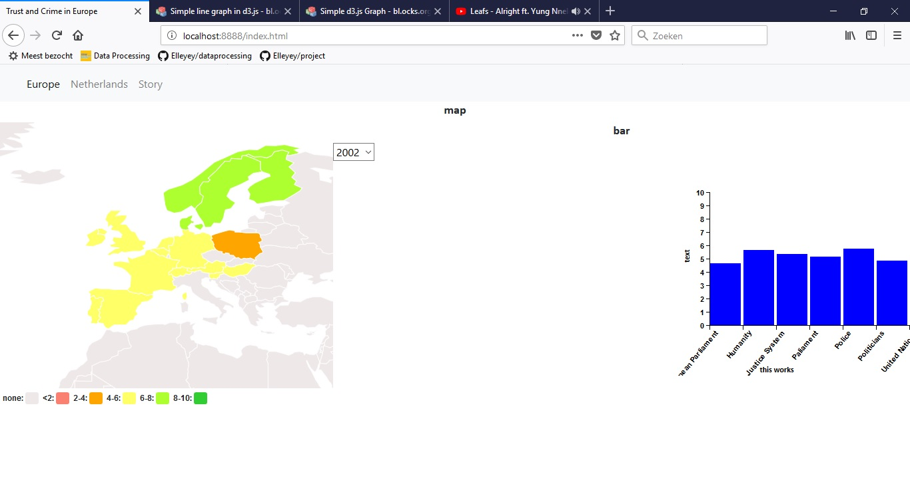
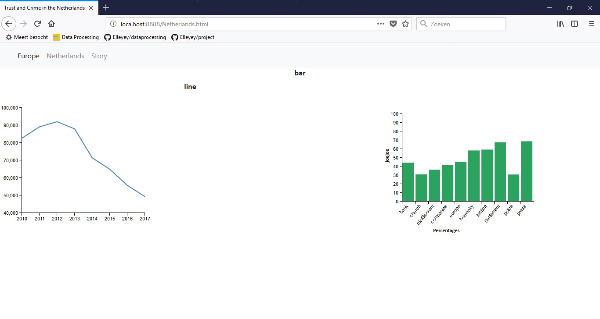
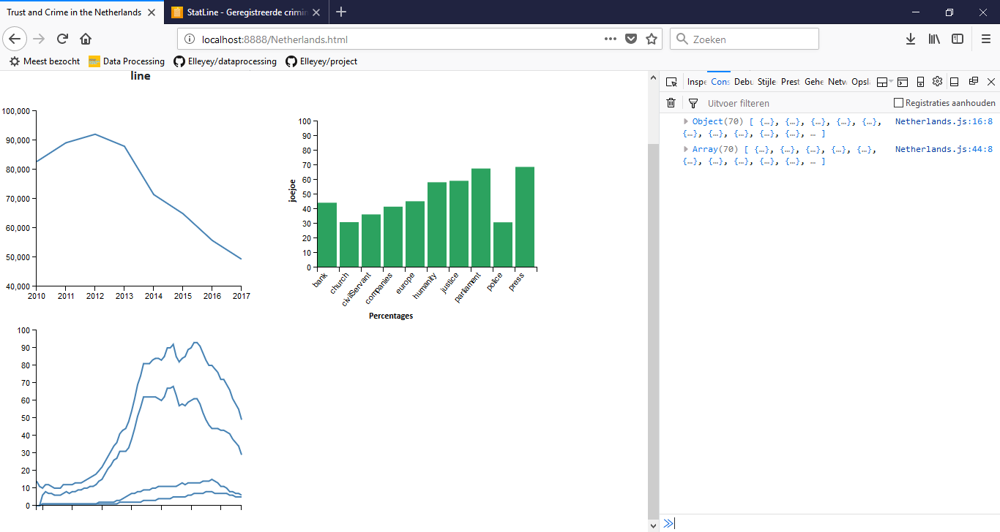
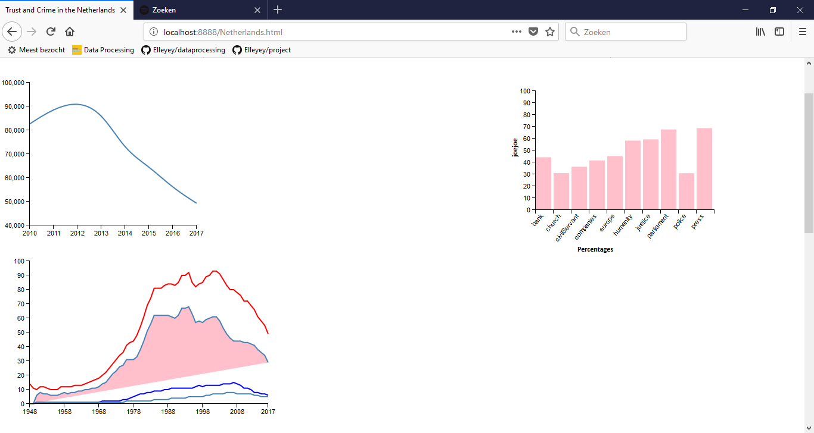
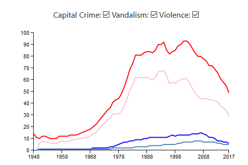

# day 4

Worked on the forming the data in a correct manner and setting up a framework for the site.
Put the datamap on the first page, got a bit annoyed.

# day 5

Did the presentation today, everything was okay. Make sure tooltip exists for data in scatterplot.

# day 6

Busy with getting the data in the right (usable) format. Want to finnish Europe today (opt. with map change), Netherlands tomorrow. Talked with assistant and decided that datastructure would be better if I put them by year and then country.
Thus: [2008 {Belgium {trust in humanity: 5, trust in police: 6}}]
OR [Belgium {2008: {....}} {2010: {...}}]

Questions to ask: how to get data Europe in right structure? how to get data dataNetherlands as response?

# day 7

Got data in right format, now trying to get it working.

# day 8

Working on map, trying to get legend on right spot. Buggy (as in it is showing twice, do not know why).
Also: tooltip in map is not working if added class through stylesheet (why?).

# day 9

page of Europe is working, but style not yet. Also I am missing a link between years and updating the barchart.

page Netherlands needs some attention. Still need to make scatterplot and second linegraph.
IDEA: maybe make new CSS for Netherlands

# day 10 (17-6-2018)

worked on multi line graph today. Data structure not right yet, also in doubt which statistics
should be showing (one from 1950 till now, missing feeling of safety OR one from 1999 to now (missing 2010 and 2011) including feeling of safety). Also dat structure not yet right, but working.

tried to make the scatter aswell - only to realize that six years is
not a lot... Also saw that I have been using some wrong data for the charts (line graph should have been crime rate in total, not burglaryRate). And should try to make scatterplot with two different datasets, not sure if possible (did not work so well when I tried):

.png)

So on MONDAY (& rest of week):
- decide on charts
- decide on which data for which charts
- try to make horizontal barchart with data of 2012 AND 2017
- try to make check boxes for crime rates multi line chart
- try to make scatterplot interactive
- try to add extra linked view to page 1
- try to make it look nice

# day 11 (18-6)

Adjusted the idea of the scatterplot after Stand Ups. They advised to use the data set of the
Netherlands and build on this one to make an interactive chart. I tried to do that and it worked, as shown in the second picture. I also adjested the axes of the other two figures.
Happy with the progress I made today! :)

after click on specific bar:

.png)

# day 12 (19-6)

had a funeral today so was not there.

# day 13 (20-6)

tried to fix the barchart on the page Europe today, so it stays and updates with the year given. Still need to make an if statement. Difficulty is that to make a barchart, data is needed in a different format than for the map - they cannot communicatie otherwise. Or make an update function instead of deleting every time?
Now possible to change country, change year (but always getting Belgium).

# day 14 (21-6)
Need to do today:

PAGE NL:

- CHECK make check boxes multi-line
- (maybe tonight) possible make button to change years in barchart netherlands

PAGE EU:

- CHECK (but still something wrong with transform/translate I think and does not work when years are changed,
  this did work before so not sure when it broke) fix barchart!!!

.png)

BOTH:

- WORKING ON IT fix looks, html

# day 15 (22-6)

presentations today, added titles and info to graphs, fixed barchart.

# day 16 (24-6)

working on code cleaning and looks of site.
- wanted to do annotation in multiline graph, is not possible in d3v3. Chose to do a circle with tooltip to explain the decreasing of crime in NL.
- also after feedback from friday presentations, decided to draw line in other chart.

# day 17 (25-6)

made update functions of map and barchart EU today, working except for title update.
Tomorrow: clean code EU and NL / clean html
