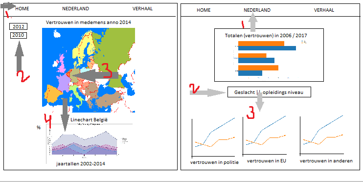

# Project Data Visualisatie - Ellemijke Donner 10734198

## Probleemstelling

 ### Inleiding:

>*'We vertrouwen erlkaar niet meer', zo zei [Jan Terlouw](https://nos.nl/video/2146366-de-toespraak-van-jan-terlouw-bij-dwdd.html) in zijn veelbesproken bericht aan het volk in december 2016. Volgens Terlouw zou het lak aan vertouwen de oorzaak zijn van veel kwaad: Trump, het niet aanpakken van klimaat vervuiling en de Brexit. Het lijkt alsof er steeds meer tegenstellingen ontstaan onder de bevolking, en de enige uitweg geboden wordt door populistische politici. Ook buiten Nederland staan veel landen op een keerpunt, zie Spanje, Italië en Engeland. De wereld staat in brand en er is niets wat we kunnen doen, zo lijkt het.*

### Gebrek aan informatie:

Is het een terrecht gevoel, wat Terlouw en met hem velen anderen hebben: is er weinig vertouwen in de Nederlandse samenleving? Deze data visualisatie schept duidelijkheid over het vertrouwen in de (Nederlandse) politiek, voor iedereen die daarin geïnteresseerd is. De data komt van het Centraal Bureau van Statistiek.

## Oplossing:

*In één zin:*

De visualisatie zal laten zien hoe het met het vertrouwen in Nederland gesteld is en hoe dit zich verhoudt tot de rest van Europa.

*Schets van de visualisatie:*

- een referentie naar het bekende 'touwtje in de deur' om op de website te komen. Misschien zet ik hiet nog wat achtergrond informatie neer.

- De eerste pagina laat de **landkaart van Europa** zien, de kleuren van de landen verwijzen naar het vertrouwen in de medemens van dat land. Er kan gekozen worden uit data van **drie verschillende jaren** om dit te visualiseren. Wanneer iemand op een land klikt, komt er een **linechart** tevoorschijn die de gegevens van dat land laat zien over een periode van 7 jaar.
  - Gebruikte dataset: *dataset Europa*.
  - Linked views: *kies jaartal voor kaart Europa - klik op kaart - verschijnen linechart.*

- De tweede pagina, waar men kan komen via **een menu** boven aan de site, laat de data van Nederland zien in een **horizontale barchart**. De precieze data kan gekozen worden via een **dropdown button**, naar gender of opleidingsniveau. Vervolgens verschijnen er drie linechart, die de gegevens weergeven van vertrouwen in politie, vertrouwen in EU, vertrouwen in medemens en vertrouwen in de NAVO.
  - Gebruikte dataset: *dataset Nederland*.
  - Linked views: *kies geslacht/onderwijs niveau - verschijnen linechart*

*Belangrijkste kenmerken:*
 - on click (op landen Europa, verschijnt correcte barchart/scatterplot)
 - on hoover, tooltip (barchart/linegraph geeft exacte percentages of variabele)

*Optioneel:*

- Pagina met make your own chart, waarin je de data zelf kan filteren (bijvoorbeeld Engeland en Nederland vergelijken op gebied van vertrouwen in Europa, politici en politie).

## Benodigdheden:

**Data:**
[CBS, Nederland 2006 - 2012](https://opendata.cbs.nl/statline/#/CBS/nl/dataset/71719NED/table?dl=8CA2), [CBS, Nederland 2012-2017](http://statline.cbs.nl/Statweb/publication/?VW=T&DM=SLNL&PA=82378ned), [CBS, Europa 2010 -2012](https://opendata.cbs.nl/statline/#/CBS/nl/dataset/80518NED/table?ts=1528103408258), [CBS, Europa 2002-2012](http://statline.cbs.nl/StatWeb/publication/?VW=T&DM=SLNL&PA=80518ned&D1=0-7&D2=0&D3=a&D4=a&HD=100816-1530&HDR=T&STB=G1,G2,G3). Beschikbaar in JSON, CSV en API.
[CBS, Nederland woninginbraak 2010-2017](http://statline.cbs.nl/Statweb/publication/?DM=SLNL&PA=83651NED&D1=0&D2=0&D3=14&D4=0&D5=a&HDR=G4%2cG3%2cG1%2cT&STB=G2&VW=D), [CBS, Geregistreerde misdaad 1999-2016 (1 variabele)](https://opendata.cbs.nl/statline/#/CBS/nl/dataset/83723NED/table?ts=1528275910601), [CBS, misdaad 1999-2017 (geweld, vandalisme, vermogen)](https://opendata.cbs.nl/statline/#/CBS/nl/dataset/81573NED/table?ts=1528276081236)

**External Components:**
   - d3
   - d3-tip
   - datamaps
   - topojson
   - dropdown

**Review(s):**
www.thehappyforecast.com/, houdt het erg simpel en meer informatie te krijgen door door te klikken. Is goede manier om niet te veel informatie in één keer te presenteren.

**Moeilijkste onderdelen:**
 - Ik verwacht dat het lastigste onderdeel het linken van alle verschillende pagina's wordt.
 - Ook moet ik een goede datascructuur opbouwen waarbij de gekozen data doorgegeven wordt en niet steeds werken met if statements.
