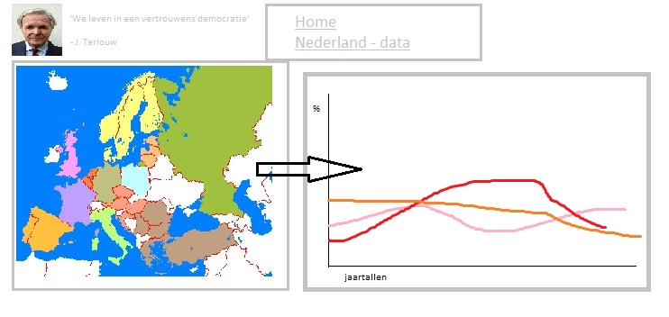
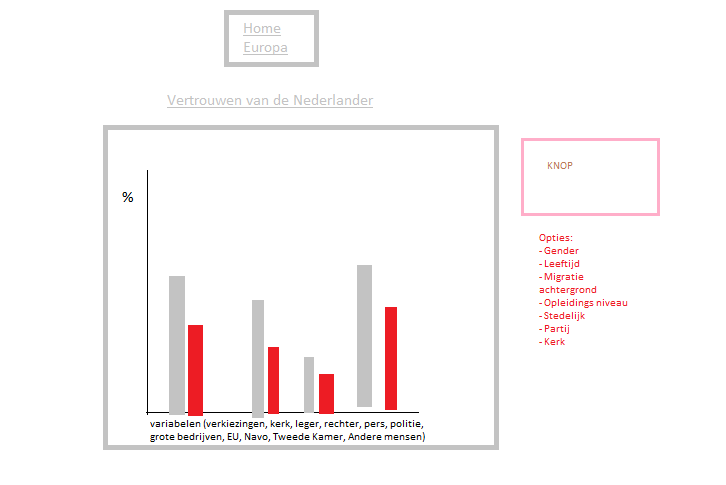

# Project Data Visualisatie

## Probleemstelling

 ### Inleiding:

>*'We vertrouwen erlkaar niet meer', zo zei [Jan Terlouw](https://nos.nl/video/2146366-de-toespraak-van-jan-terlouw-bij-dwdd.html) in zijn veelbesproken bericht aan het volk in december 2016. Volgens Terlouw zou het lak aan vertouwen de oorzaak zijn van veel kwaad: Trump, het niet aanpakken van klimaat vervuiling en de Brexit. Het lijkt alsof er steeds meer tegenstellingen ontstaan onder de bevolking, en de enige uitweg geboden wordt door populistische politici. Ook buiten Nederland staan veel landen op een keerpunt, zie Spanje, Italië en Engeland. De wereld staat in brand en er is niets wat we kunnen doen, zo lijkt het.*

### Gebrek aan informatie:

Is het een terrecht gevoel, wat Terlouw en met hem velen anderen hebben: is er weinig vertouwen in de Nederlandse samenleving? Deze data visualisatie schept duidelijkheid over het vertrouwen in de (Nederlandse) politiek, voor iedereen die daarin geïnteresseerd is. De data komt van het Centraal Bureau van Statistiek.

## Oplossing:

*In één zin:*

De visualisatie zal laten zien hoe het met het vertrouwen in Nederland gesteld is en hoe dit zich verhoudt tot de rest van Europa. 

*Schets van de visualisatie:*

- een referentie naar het bekende 'touwtje in de deur' om op de website te komen. Misschien zet ik hiet nog wat achtergrond informatie neer. 

- De eerste pagina laat de landkaart van Europa zien, de kleuren van de landen verwijzen naar het vertrouwen in de medemens van dat land. Wanneer iemand op een land klikt, komt er een barchart OF **scatterplot** tevoorschijn. 

- De tweede pagina, waar men kan komen via een menu boven aan de site, laat de data van Nederland zien. De precieze data kan gekozen worden via een dropdown button, naar gender, leeftijd, migratie achtergrond, onderwijs niveau, stedelijkheid en partij keuze. Wellicht maak ik daar nog wat minder keuzes van. 

*Belangrijkste kenmerken:*
 - on click (op landen Europa, verschijnt correcte barchart/scatterplot)
 - on hoover, tooltip (barchart/scatterplot geeft exacte percentages of variabele)
 

*Optioneel:*

- Pagina met make your own chart, waarin je de data zelf kan filteren (bijvoorbeeld Engeland en Nederland vergelijken op gebied van vertrouwen in Europa, politici en politie). 

